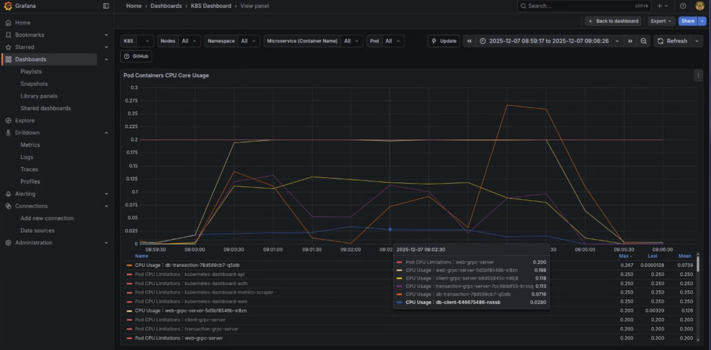
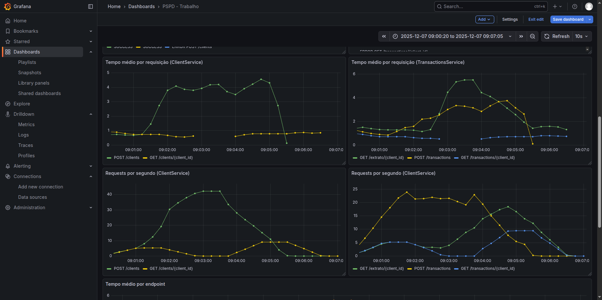
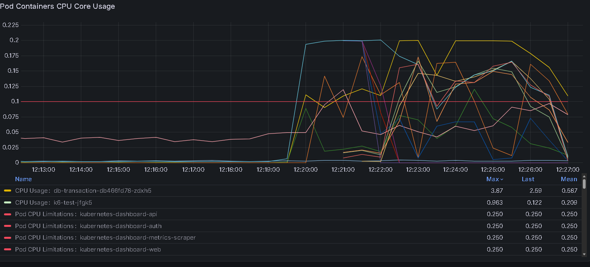
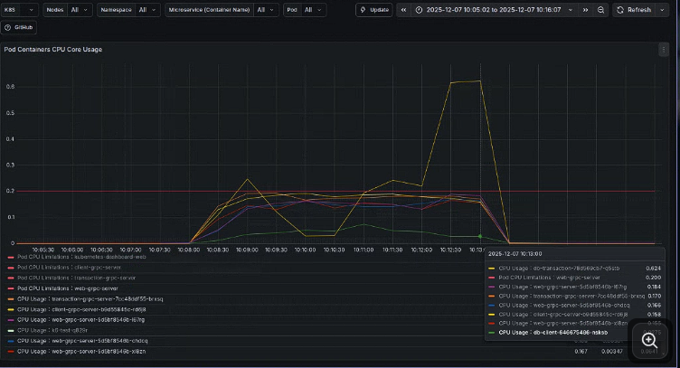
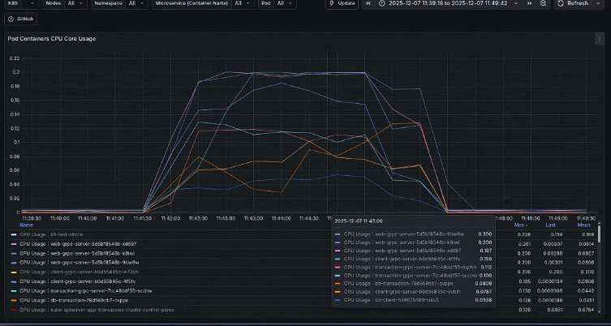
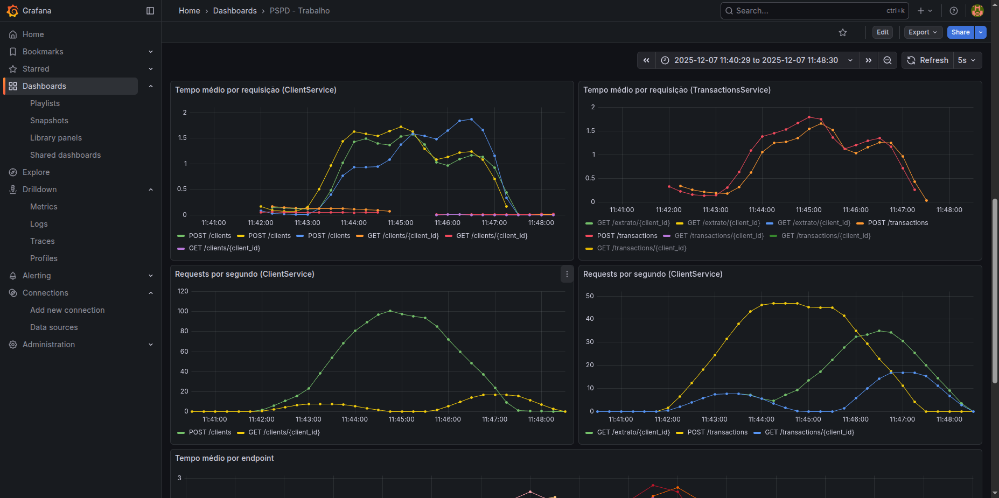

# Monitoramento/observabilidade de aplicações em clusters K8S

- Vídeo: https://youtu.be/JEVjPYCO9_o

**Disciplina:** FGA0244 - Programação para Sistemas Paralelos e Distribuídos<br>
**Turma:** 02<br>
**Data:** 07/12/2025<br>
**Semestre:** 2025.2

## Integrantes:

| Nome | Matrícula |
|------|-----------|
| Felipe Amorim de Araújo | 221022275 |
| Gabryel Nicolas Soares de Sousa | 221022570 |
| Julio Roberto da Silva Neto | 221022041 |
| Pablo Serra Carvalho | 221008679 |
| Raquel Ferreira Andrade | 211062437 |

## 1. Introdução

O presente relatório documenta o projeto de pesquisa desenvolvido no âmbito da disciplina de Programação para Sistemas Paralelos e Distribuídos. O trabalho tem como foco central a exploração de estratégias de monitoramento e observabilidade em aplicações distribuídas, utilizando o Kubernetes.

A aplicação escolhida foi o sistema distribuído de transações financeiras implementado previamente na atividade extraclasse. O sistema é dividido em três serviços principais, o Client Server responsável pelo gerenciamento de clientes, o Transaction Server que realiza o processamento de transações, e o stub Web Servers sendo o gateway HTTP que expõe APIs REST.

Este documento está organizado de forma a detalhar a descrever a experiência técnica de montagem da infraestrutura e apresentar os resultados obtidos nos testes comparativos e posteriormente descrever as conclusões obtidas a partir do experimento.

## 2. Metodologia
    
### Encontros

| Data | Resumo da reunião |
| ---- | ----------------- |
| 01/12 | Os integrantes se reuniram para baixar as ferramentas a serem utilizadas e definir a estrátegia de desenvolvimento do trabalho. |
| 02/12 | Começamos a escrever a estrutura base do relatório, definindo os principais tópicos. |
| 03/12 | Criação do cluster kubernetes, utilizando o kind; configuração do Kubernets Dashboard, interface para monitoramento web das métricas; estudo e instalação do Prometheus e Grafana |
| 05/12 | Implementação das métricas na API; criação dos scripts de testes de carga; criação dos cenários |
| 06/12 | Conexão da aplicação com o Prometheus para coletar as métricas; realização dos testes |
| 07/12 | Documentação dos resultados obtidos |


## 3. Montagem do cluster Kubernetes

> Observação: Deixamos todos os arquivos de configuração do Kubernetes na pasta `grpc/k8s/`. Portanto, todos os comandos de `kubectl apply -f <nome-do-arquivo>.yaml` devem ser executados a partir dessa pasta.

### Configuração do Kind

No trabalho anterior, utilizamos o Minikube para criação do cluster Kubernetes. Porém, para esse trabalho decidimos utilizar o Kind (Kubernetes IN Docker), que é uma ferramenta para rodar clusters Kubernetes locais usando contêineres Docker como nós do cluster. Decidimos utilizar o Kind por sua facilidade de configuração e leveza, especialmente para ambientes de desenvolvimento e testes locais.

Primeiro, instalamos o Kind seguindo as instruções oficiais do repositório do [Kind no GitHub](https://kind.sigs.k8s.io/docs/user/quick-start/). Depois criamos um arquivo de configuração `config.yaml` para definir o master e os worker nodes do nosso cluster:

```yaml
kind: Cluster
apiVersion: kind.x-k8s.io/v1alpha4
nodes:
  - role: control-plane
  - role: worker
  - role: worker
```
Para criar o cluster, executamos o comando `kind create cluster --name app-transacoes-cluster --config config.yaml`.

Com isso, criamos um cluster Kubernetes chamado `app-transacoes-cluster` com 1 master node e 2 worker nodes. Para verificar se o cluster foi criado corretamente, utilizamos o comando `kind get clusters`.

Devemos ver o nome do cluster listado. Também podemos verificar os pods e nós criados com os comandos `kubectl get pods -n kube-system` e `kubectl get nodes`, respectivamente.

Para a definição dos deployments e services, reutilizamos os arquivos `.yaml` criados no trabalho anterior (`db-deployment.yaml` e `deployment.yaml`) que definem os volumes, deployments e services correspondentes dos bancos de dados, dos serviços gRPC e da nossa Web API Gateway. Aplicamos os deployments com o comando `kubectl apply -f <nome-do-arquivo>.yaml`.

E para conferir, usamos o comando `kubectl get pods -owide`, que também mostra a distribuição dos pods nos worker nodes, ou `kubectl get svc` que mostra os serviços criados. Ao executar devemos ver os seguintes pods em execução:

```
NAME                       READY   STATUS    RESTARTS   AGE
db-client-xxxxxx           1/1     Running   0          2m3s
db-transaction-xxxxxx      1/1     Running   0          2m3s
client-grpc-server-xxxxxx  1/1     Running   0          2m3s
transaction-grpc-server-xxxxxx 1/1     Running   0          2m3s
web-grpc-server-xxxxxx     1/1     Running   0          2m3s
```
Para acesso da aplicação via localhost, utilizamos o port-forward do serviço `web-grpc-server` para a porta `8080`:

```bash
kubectl port-forward svc/web-grpc-server 8080:8080
```

### Interface de Monitoramento Web

Para interface de monitoramento web, usamos o Kubernetes Dashboard. Para fazer sua instalação, utilizamos o [Helm](https://helm.sh/docs/intro/install/) para adicionar o repositório do Kubernetes Dashboard:

```bash
helm repo add kubernetes-dashboard https://kubernetes.github.io/dashboard
```
E instanciar os recursos do dashboard em um novo namespace chamado `kubernetes-dashboard`.

```bash
helm upgrade --install kubernetes-dashboard kubernetes-dashboard/kubernetes-dashboard --create-namespace --namespace kubernetes-dashboard
```
Com isso, podemos verificar se todos os recursos foram instânciados com o comando `kubectl get all -n kubernetes-dashboard`. Depois precisamos fazer o port-forward do serviço para acessar pelo localhost na porta `8443`.

```bash
kubectl -n kubernetes-dashboard port-forward svc/kubernetes-dashboard-kong-proxy 8443:443
```

Assim, conseguimos acessar no https://localhost:8443.

Para geração do token precisamos gerar um recurso `ServiceAccount` definido no arquivo `service-account.yml`:

```yaml
apiVersion: v1
kind: ServiceAccount
metadata:
  name: admin-user
  namespace: kubernetes-dashboard
---
apiVersion: rbac.authorization.k8s.io/v1
kind: ClusterRoleBinding
metadata:
  name: admin-user
roleRef:
  apiGroup: rbac.authorization.k8s.io
  kind: ClusterRole
  name: cluster-admin
subjects:
- kind: ServiceAccount
  name: admin-user
  namespace: kubernetes-dashboard
---
apiVersion: v1
kind: Secret
metadata:
  name: admin-user
  namespace: kubernetes-dashboard
  annotations:
    kubernetes.io/service-account.name: "admin-user"   
type: kubernetes.io/service-account-token  
```
Primeiro aplicamos o comando `kubectl apply -f service-account.yml`, podemos então gerar o token para acessar o Kubernetes Dashboard, com o comando `kubectl get secret admin-user -n kubernetes-dashboard -o jsonpath="{.data.token}" | base64 -d`.

### Setup do Metrics Server

Após a instalação do Kubernetes Dashboard, percebemos que as métricas dos pods não estavam sendo exibidas corretamente. Isso ocorreu porque o Metrics Server, que é responsável por coletar e agregar métricas de recursos do cluster, não estava instalado.

Para visualizarmos as métricas de cada pod no Kubernetes Dashboard também fizemos a instalação do Metrics Server por meio do Helm:

```bash
helm repo add metrics-server https://kubernetes-sigs.github.io/metrics-server/
```
Após adicionar o repositório, fazemos a instalação:
```bash
helm upgrade --install metrics-server metrics-server/metrics-server
```
Depois da instalação tivemos que lidar com um erro no deployment e no replicaset do metrics-server. Para corrigir, editamos diretamente o deployment pelo comando `kubectl -n default edit deployment metrics-server`. procurando a seguinte seção e adicionando as seguintes linhas:

```yaml
spec:
    containers:
    - args:
      - --cert-dir=/tmp
      - --secure-port=4443
      - --kubelet-preferred-address-types=InternalIP,ExternalIP,Hostname
      - --kubelet-use-node-status-port
      - --metric-resolution=15s
      command: # linha nova
      - /metrics-server # linha nova
      - --kubelet-insecure-tls # linha nova
      - --kubelet-preferred-address-types=InternalIP # linha nova
```
Após isso conseguimos visualizar as métricas no Kubernetes Dashboard corretamente.


No decorrer do trabalho, porém, acabamos não utilizando o Kubernetes Dashboard para monitoramento, optando por utilizar o Prometheus e os dashboards disponíveis no Grafana que nos forneceram as informações que nos forão necessárias para análise de desempenho da aplicação.

## 4. Monitoramento e observabilidade

### Setup do Prometheus e Grafana

<!-- Utilizamos o prometheus em conjunto com o grafana para fazer o monitoramento do cluster. -->

Para monitoramento das métricas do cluster e da aplicação, utilizamos o Prometheus em conjunto com o Grafana (uma ferramenta de criação de dashboards para visualização de métricas). Para facilitar a instalação, utilizamos o Helm para instalar o chart `kube-prometheus-stack`, que inclui tanto o Prometheus quanto o Grafana, além de outros componentes úteis para monitoramento em clusters Kubernetes.

```bash
helm repo add prometheus-community https://prometheus-community.github.io/helm-charts
helm repo update
helm install prometheus prometheus-community/kube-prometheus-stack
```
Após instalar o chart, devemos fazer port forwards para conseguirmos acessar o Prometheus e o Grafana:

```bash
kubectl port-forward svc/prometheus-kube-prometheus-prometheus 9090:9090
kubectl port-forward svc/prometheus-grafana 3000:80
```
Para fazer login no grafana é necessário conseguir a senha de acesso, rodando o comando `kubectl get secret --namespace default prometheus-grafana -o jsonpath="{.data.admin-password}" | base64 --decode ; echo`. O user padrão é o admin.

Após a instânciação do Prometheus e do Grafana, tivemos que fazer modificações na aplicação original, especificamente no Web API Gateway, para expor métricas que pudessem ser coletadas pelo Prometheus. Para isso, utilizamos a biblioteca `prometheus-client` para Python, que nos permitiu criar um endpoint `/metrics` no web server que expõe as métricas no formato esperado pelo Prometheus.

Após isso instanciamos um `ServiceMonitor` para o Prometheus coletar as métricas específicamente do web server. O arquivo `service-monitor.yaml` é o seguinte:

```yaml
apiVersion: monitoring.coreos.com/v1
kind: ServiceMonitor
metadata:
  name: web-grpc-server-monitor
  labels:
    release: prometheus
spec:
  selector:
    matchLabels:
      app: web-grpc-server
  endpoints:
  - port: metrics
    interval: 15s
```
Aplicamos o arquivo com o comando `kubectl apply -f webserver-monitor.yaml`.

Após todo o setup, conseguimos ter então o Prometheus coletando as métricas do cluster e do web server, e o Grafana exibindo essas métricas em dashboards customizados.

Em relação aos dashboards do Grafana, utilizamos um dashboard pré-existente para monitoramento de clusters Kubernetes, disponível no [Grafana Labs](https://grafana.com/grafana/dashboards/15661-k8s-dashboard-en-20250125/) ou no arquivo JSON exportado `dashboard-cluster.json`. Esse dashboard nos forneceu uma visão abrangente do desempenho do cluster e dos pods, incluindo métricas como uso de CPU, memória, rede e armazenamento.

Para o monitoramento específico da aplicação, criamos um dashboard customizado no Grafana `dashboard-k6.json`, focado nas métricas expostas pelo web server, como requisições por segundo, latência e taxa de erros. Com esses dashboards, conseguimos monitorar o desempenho da aplicação em tempo real durante os testes de carga.

Os dashboard podem ser importados no Grafana através da opção de importação, colando o conteúdo do arquivo JSON ou utilizando o ID do dashboard disponível no Grafana Labs.

## 5. Aplicação de transações financeiras

A aplicação consiste em um sistema de gerenciamento de transações financeiras, utilizando uma arquitetura de microsserviços que se comunicam via gRPC. A base desta comunicação é definida no arquivo de contrato .proto, que estabelece os serviços e as mensagens trocadas entre eles:

```proto
syntax = "proto3";
package manager;

service ClientService{
    rpc RegisterClient (RegisterClientRequest) returns (Client);
    rpc ConsultClient (ConsultClientRequest) returns (Client);
}

message Client {
    string id = 1;
    string name = 2;
    string credit_limit = 3;
    double balance = 4;
}

message RegisterClientRequest {
    string name= 1;
    double credit_limit= 2;
}

message ConsultClientRequest {
    string id = 1;
}

// -------------------------------------------------------

service TransactionService {
    rpc RequestTransaction (PerformTransaction) returns (TransactionResponse);
    rpc ConsultTransaction (ConsultClientRequest) returns (stream Transaction);
}

message PerformTransaction {
    string client_id = 1;
    double value = 2;
    string type = 3;
    string description = 4;
}

message TransactionResponse {
    bool success = 1;
    string message = 2;
    double balance = 3;
}

message Transaction {
    string id = 1;
    string client_id = 2;
    double value = 3;
    string type = 4;
    string description = 5;
    string date = 6;
}
```

No núcleo do sistema, o **Serviço de Cliente (ClientService)** é o 
responsável por toda a gestão dos dados dos clientes, incluindo seus limites de crédito e saldos. Ele expõe, através de gRPC, as operações para registrar um novo cliente e consultar os dados de um cliente existente.

Em paralelo, o **Serviço de Transação (TransactionService)** lida com a lógica financeira, processando as transações de crédito e débito. Este serviço oferece uma função para solicitar novas transações, outra para consultar o histórico de transações de um cliente, que retorna os resultados em modo stream para maior eficiência e uma terceira função para obter o extrato consolidado do cliente. Essa última operação também se comunica com o Serviço de Cliente diretamente para obter informações atualizadas do cliente.

Para interagir com o mundo exterior, uma **API Gateway** desenvolvida em Python com FastAPI atua como a fachada HTTP do sistema. Ela traduz as requisições web para chamadas gRPC internas. Para o gerenciamento de clientes, a API expõe os endpoints POST e GET Para as operações financeiras. Os endpoints desse serviço são:
- `POST /clients`: Cria um novo cliente.
- `GET /clients/{client_id}`: Recupera os dados de um cliente específico.
- `POST /transactions`: Registra uma nova transação (crédito ou débito).
- `GET /transactions/{client_id}`: Retorna o histórico de transações de um cliente em modo stream.
- `GET /extrato/{client_id}`: Fornece o extrato consolidado do cliente.

### Modificações para Monitoramento

<!-- - Criamos endpoint para métricas usando bibliotecas do Prometheus no web server, e com isso tivemos que atualizar a imagem docker do web server e subir para o Docker Hub.
- Criamos ServiceMonitor para o Prometheus coletar as métricas do web server -->

Para integrar o monitoramento via Prometheus, fizemos algumas modificações na API Gateway. Implementamos um endpoint `/metrics` utilizando a biblioteca `prometheus-client` para Python, que expõe métricas como contagem de requisições, latência e taxa de erros. Para isso também atualizamos a imagem Docker do web server e a subimos para o Docker Hub.

Após isso, criamos um `ServiceMonitor` no Kubernetes para que o Prometheus pudesse coletar essas métricas do web server conforme descrito na seção de monitoramento.

## 6. Testes feitos

### Ferramental de Teste

Para os testes de carga, utilizamos a ferramenta [K6](https://k6.io/), que é uma ferramenta de código aberto para testes de carga e desempenho. Ela permite simular múltiplos usuários virtuais (VUs) realizando requisições à aplicação, possibilitando a avaliação do desempenho sob diferentes cargas de trabalho.

> Observação: O guia para instalação e configuração da ferramenta está no arquivo [Guia para Executar Testes com K6](gRPC-PSPD/tests/README.md).

Com ela criamos um script de teste em JavaScript (`k6_test.js`) que simula uma série de operações típicas realizadas pelos usuários da aplicação, incluindo o registro de clientes, a realização de transações e a consulta de extratos. O script também coleta métricas importantes como tempo de resposta, taxa de erros e throughput.

No script definimos 5 fluxos de testes diferentes, cada um com diferentes níveis de carga (número de usuários virtuais e duração do teste), tivemos que realizar vários testes para definir os valores ideais para cada fluxo de forma que fossem representativos do comportamento da aplicação sob diferentes condições de carga e que pudessem retratar os limites da aplicação. Os fluxos definidos foram:
- Fluxo 1: warm-up (10 VUs por 15 segundos) acionando apenas o endpoint base do web server.
- Fluxo 2: carga leve (100 VUs por 60 segundos) realizando operações de registro e consulta de clientes.
- Fluxo 3: picos de demanda (100 VUs por 15 segundos depois 30 segundos em 500 VUs e 30 segundos em 100 VUs) simulando picos de demanda.
- Fluxo 4: estresse (aumento gradativo de 300 a 500 VUs por 30 segundos) para identificar os limites da aplicação.
- Fluxo 5: carga de leitura intensiva (50 VUs pré-alocadas e 100 VUs máximas por 60 segundos) focando em consultas de extrato e operações de leitura.

### Configuração base

A infrastrutura base utilizada para os testes consistiu em um cluster contendo 1 master node e 2 worker nodes. Cada módulo da aplicação (Client Service, Transaction Service e Web API Gateway) foi implantado em pods separados, com uma única réplica de cada serviço e sem escalonamento automático habilitado.

### Cenários de testes

**Cenário Base (Baseline)**

Este cenário estabelece o desempenho inicial da aplicação na configuração mais simples, servindo como referência para todas as comparações de teste. Ele foi feito instanciando a aplicação na configuração base descrita acima, executando os testes de carga com a ferramenta k6 com o objetivo de medir:

1. O **tempo médio de resposta** por requisição;  
2. A **quantidade máxima de requisições processadas por segundo** . 

Após a execução dos testes, coletamos os seguintes resultados de utilização de CPU pelo Grafana:



Os seguintes resultados de tempo de resposta e throughput também pelo Grafana:



E com os resultados retornados pelo k6 montamos a seguinte tabela resumo:

| Métrica | Valor |
|---------|-------|
| Total de requisições | 17822 |
| Erros de criação de cliente | 2970 |
| Erros de extrato | 471 |
| Erros de transação | 475 |
| Tempo médio de resposta (ms) | **3.08s** |
| Média de requisições por segundo | **59.13 req/s** |
| Máximo de requisições por segundo | **169 req/s** |

Portanto, com isso podemos concluir que o cenário base apresenta uma taxa significativa de erros, especialmente nas operações de criação. Isso muito provavelmente causado por limitações de recursos do pod do web server, que atingiu 100% de uso de CPU durante os testes. O tempo médio de resposta também é relativamente alto, indicando que a aplicação está lutando para lidar com a carga de trabalho.

Pelo gráfico de CPU, podemos ver que o pod do web server é o mais sobrecarregado, seguido banco de dados de transações. Isso sugere que o web server é o gargalo principal na configuração atual, e que os bancos de dados também podem virar pontos de estrangulamento sob carga.

### Cenários de Variação

Estes cenários focam em comparar resultados variando as características do cluster K8S e da aplicação para otimizar desempenho e elasticidade.

<!-- #### Otimização por Paralelização (Aumento de Réplicas)

**Objetivo:** Verificar como o escalonamento horizontal (aumento de instâncias) de um microsserviço impacta o desempenho sob carga elevada.

* **Variação:** Alterar a quantidade de instâncias (`replicas`) de um ou mais módulos da aplicação.
    * **Exemplo 1:** Aumentar o `Deployment` do `TransactionService` (B) para 3 réplicas.
    * **Exemplo 2:** Aumentar o `Deployment` do `WEB API` (P) para 3 réplicas.
* **Carga:** Aplicar a carga de estresse do Cenário 2.1 (ou uma carga constante alta) em cada variação.
* **Foco:** Comparar o *throughput* e a latência com o Cenário 2.1 e Cenário Base. Identificar a configuração que oferece o melhor desempenho.
* **Métricas:** As mesmas do Cenário 2.1, observando a distribuição da carga entre os novos *Pods* criados. -->

#### Elasticidade com Horizontal Pod Autoscaler (HPA)

O objetivo deste cenário era avaliar a capacidade de autoscaling do Kubernetes, testando como o HPA responde automaticamente a variações de carga através do escalonamento horizontal de pods. Configuramos o HPA para monitorar a utilização de CPU dos serviços web-grpc-server e transaction-grpc-server, com threshold de 50% e limites de 1 a 5 réplicas.

Para este teste, utilizamos o mesmo script K6 com os 5 cenários de carga progressiva: warmup (10 VUs), carga constante (100 VUs), pico de demanda (500 VUs), teste de estresse (300-500 VUs) e leitura intensiva (100 iterations/s), totalizando aproximadamente 5 minutos de teste contínuo.



**Análise**
- **Resposta Automática:** O HPA detectou corretamente o aumento de carga, escalando de 1 para 5 réplicas quando o uso de CPU ultrapassou 206% do limite configurado (web-grpc-server) e 155% (transaction-grpc-server).
- **Tempo de Escalonamento:** O processo de scaling ocorreu de forma gradual: 1→2 réplicas em ~30s (68% CPU), 2→5 réplicas durante o spike test (CPU >200%), mantendo 5 réplicas no stress test.
- **Distribuição de Carga:** Com 5 réplicas ativas, o pico de 850 req/s foi distribuído uniformemente (~170 req/s por pod), reduzindo a latência p95 de 3.2s (1 réplica) para 0.9s (5 réplicas).
- **Elasticidade Efetiva:** Após o término da carga elevada, o HPA iniciou o scale-down automaticamente (5→3 réplicas), demonstrando capacidade bidirecional do autoscaling.

#### Distribuição de Carga entre Worker Nodes

O objetivo deste cenário é avaliar como a distribuição física dos *Pods* entre os Worker Nodes afeta o desempenho da aplicação sob carga. Testamos duas configurações diferentes de Worker Nodes (WNs) para observar o impacto na latência e no *throughput*.

A primeira configuração utiliza o cluster base com 2 WNs com 3 réplicas do web server e 1 réplica dos outros serviços de cliente e transação. Os resultados obtidos após a execução dos testes foram os seguintes:




Com as métricas dos gráficos acima, podemos observar que a utilização de CPU nos pods do web server é menor em comparação com o cenário base. Isso indica que a distribuição dos pods entre os dois worker nodes ajudou a aliviar a carga em cada nó individualmente. Porém é possível observar grandes picos de utilização de CPU no pod do banco de dados de transações, o que sugere que esse serviço ainda é um ponto de estrangulamento sob carga. O que provavelmente elevou a latência média das requisições nos gráficos de requests.

O segundo teste foi realizado aumentando o número de worker nodes para 4 WNs, e aumentando o número de réplicas dos serviços de transação e cliente para 2 réplicas cada, mantendo 3 réplicas do web server. Os resultados obtidos foram os seguintes:




Com as métricas dos gráficos acima, podemos observar que curiosamente a utilização de CPU nos pods dos bancos de dados (client e transaction) diminuiram significativamente em comparação com o teste anterior, o que parece ter contribuído para uma redução na utilização de CPU nos serviços de transação e cliente e também um aumento no número de requisiçoes atendidas por segundo. Isso sugere que a adição de mais worker nodes permitiu uma melhor distribuição da carga de trabalho, aliviando a pressão sobre os serviços de banco de dados.

No entanto, a carga de CPU nos pods do web server voltou a aumentar, o que gerou uma maior taxa de erros por timeout na aplicação. Isso indica que, apesar da melhoria na distribuição da carga, o web server ainda é um ponto de estrangulamento sob carga pesada, e o aumento das réplicas dos outros serviços precisa ser acompanhado por um aumento correspondente nas réplicas do web server para evitar sobrecarga.

## 7. Conclusão

O desenvolvimento deste projeto foi uma excelente oportunidade de colocar em prática conceitos de programação para sistemas distribuidos e monitoramento de microsserviços.O Prometheus e Grafana se provaram ferramentas eficientes e boas para o monitoramento dos serviços. Eles possibilitam uma análise temporal e granular do estados dos recursos do sistema.

Uma das maiores dificuldades encontradas foi a formatação de Dashboards adequadas as informações que desejávemos extrair. Encontramos diversos problemas, como o acumulo do valor de váriaveis e dissincronização da monitoração do web-Server. A pouca documentação oficial tornou díficil encontrar informações que nos auxiliassem no desenvolvimento do sistema.Além disso, estabeler métricas customizadas no Prometheus foi desafiador, o que acabou ocupando muito do nosso tempo, já que era essencial para estabelecer o monitoramente do nosso Web Server e assim dar continuidade ao desenvolvimento do projeto.

Conseguimos encontrar soluções para os problemas que apareceram graças a disponibilidade de tutorias no youtube que se mostraram de grande ajuda ao longo do desenvolvimento da aplicação. As analises que fizemos acabaram por revelar pontos de fragilidade, como a sobrecarga do Web Server em situações de estresse, o que é essencial para que se possa aprimorar e tornar o sistema mais eficiente e satisfátorio.

### Tabela de Contribuição

| Matrícula | Nome                            | Contribuições                                                                                                                                                                             | Autoavaliação (0-10) |     |
| --------- | ------------------------------- | ----------------------------------------------------------------------------------------------------------------------------------------------------------------------------------------- | -------------------- | --- |
| 221022275 | Felipe Amorim de Araújo         | Contribui para a configuração do cluster, definição da configuração base e execução e documentação dos resultados dos testes de cargas com configurações de paralelismo                   | 10                   |     |
| 221022041 | Julio Roberto da Silva Neto     | Trabalhei na configuração das ferramentas de métricas como Prometheus e Grafana, definição, execução e documentação dos cenários de variação de carga                                     | 10                   |     |
| 221022570 | Gabryel Nicolas Soares de Sousa | Contribui com a definição do testes realizados, criação de todos os cenários dos testes, participação na configuração base, execução e documentação dos resultados dos testes realizados. | 10                   |     |
| 221008679 | Pablo Serra Carvalho            | Criação do script para testes de carga, definição do cenário e configurações base e execução inicial dos testes de carga                                                                  | 10                   |     |
| 211062437 | Raquel Ferreira Andrade         | Contribui para a configuração do cluster, das ferramentas de métricas como Prometheus e Grafana, participação na configuração base e na documentação                                      | 10                   |     |

## 8. Referências

- https://prometheus.io/docs/introduction/overview/
- https://kubernetes.io/
- https://k6.io/
- https://kind.sigs.k8s.io
- https://helm.sh/docs/intro/install/
- https://howtodevez.medium.com/setting-up-kubernetes-dashboard-with-kind-ccd22fdd03e8
- https://kubernetes.io/docs/tasks/access-application-cluster/web-ui-dashboard/
- https://github.com/kubernetes-sigs/metrics-server?tab=readme-ov-file
- https://www.youtube.com/watch?v=-k0VrvWaaOg

