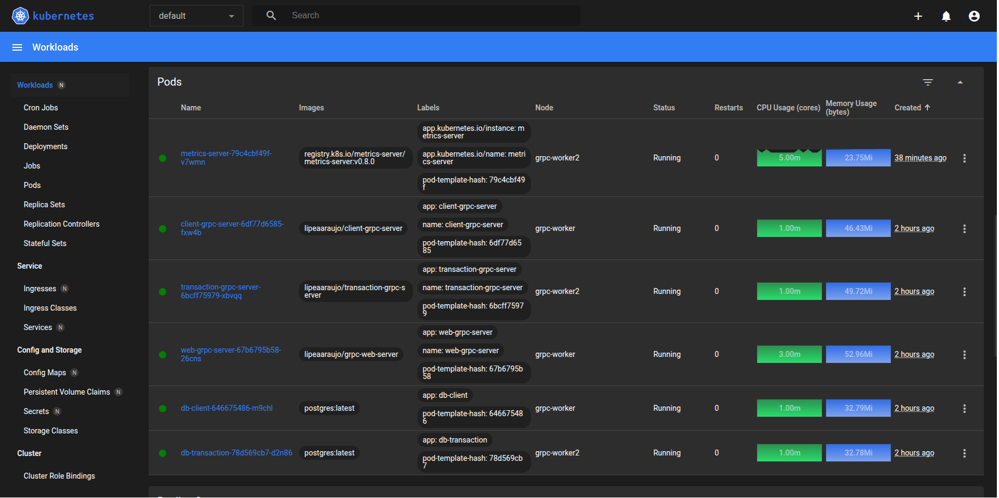

# Monitoramento/observabilidade de aplicações em clusters K8S

Disciplina: FGA0244 - Programação para Sistemas Paralelos e Distribuídos

Turma: 02

Data: 07/12/2025

Semestre: 2025.2

## Integrantes:

| Nome | Matrícula |
|------|-----------|
| Felipe Amorim de Araújo | 221022275 |
| Gabryel Nicolas Soares de Sousa | 221022570 |
| Julio Roberto da Silva Neto | 221022041 |
| Pablo Serra Carvalho | 221008679 |
| Raquel Ferreira Andrade | 211062437 |

## 1. Introdução

O presente relatório documenta o projeto de pesquisa desenvolvido no âmbito da disciplina de Programação para Sistemas Paralelos e Distribuídos. O trabalho tem como foco central a exploração de estratégias de monitoramento e observabilidade em aplicações distribuídas, utilizando o Kubernetes.

A aplicação escolhida foi o sistema distribuído de transações financeiras implementado previamente na atividade extraclasse. O sistema é dividido em  
(Breve descrição do trabalho grpc)

Este documento está organizado de forma a detalhar a descrever a experiência técnica de montagem da infraestrutura e apresentar os resultados obtidos nos testes comparativos e posteriormente descrever as conclusões obtidas a partir do experimento.

## 2. Metodologia

<!-- A metodologia utilizada (como cada grupo se organizou para realizar a atividade, incluindo um roteiro
sobre os encontros realizados e o que ficou resolvido em cada encontro) -->
    
### Encontros

| Data | Resumo da reunião |
| ---- | ----------------- |
| 01/12 | Os integrantes se reuniram para baixar as ferramentas a serem utilizadas e definir a estrátegia de desenvolvimento do trabalho. |
| 02/12 | Começamos a escrever a estrutura base do relatório, definindo os principais tópicos. |
| 03/12 | Criação do cluster kubernetes e nós utilizando o kind |


## 3. Montagem do cluster Kubernetes

- Decidimos usar o kind. Escolhemos pela facilidade para criação de clusters utilizando essa ferramenta.
- Criamos um arquivo `config.yaml` para definir o master e os worker nodes do nosso cluster com o kind. Inicialmente definimos 1 master node e 2 worker nodes. Para rodar, executar o comando `kind create cluster --name grpc --config config.yaml`. Para conferir rodar o comando `kind get clusters`, deve aparecer o cluster "grpc". Pode-se conferir os pods pelo comando `kubectl get pods -n kube-system`, e os nós criados com o comando `kubectl get nodes`. 
- Reutilizamos os arquivos .yaml criados no último trabalho (`db-deployment.yaml` e `deployment.yaml`) para instanciação do volumes, deployments e services correspondentes dos bancos de dados, dos serviços gRPC e da nossa Web API Gateway. Eles foram criados inicialmente em conjunto com o minikube, porém não tivemos problemas em utilizá-los com o kind. O comando para aplicar os deployments é `kubectl apply -f <nome-do-arquivo>.yaml`. E para conferir podemos usar o `kubectl get pods -owide`, que também mostra a distribuição nos worker nodes.

### Interface de Monitoramento Web

Para interface de monitoramento web, decidimos usar o Kubernetes Dashboard. Para fazer sua instalação, utilizamos o [Helm](https://helm.sh/docs/intro/install/) para adicionar o repositório do Kubernetes Dashboard:

```bash
helm repo add kubernetes-dashboard https://kubernetes.github.io/dashboard
```
E instanciar os recursos do dashboard em um novo namespace chamado `kubernetes-dashboard`.

```bash
helm upgrade --install kubernetes-dashboard kubernetes-dashboard/kubernetes-dashboard --create-namespace --namespace kubernetes-dashboard
```
Com isso, podemos verificar se todos os recursos foram instânciados com o comando `kubectl get all -n kubernetes-dashboard`. Depois precisamos fazer o port-forward do serviço para acessar pelo localhost na porta `8443`.

```bash
kubectl -n kubernetes-dashboard port-forward svc/kubernetes-dashboard-kong-proxy 8443:443
```

Assim, conseguimos acessar no https://localhost:8443.

Para geração do token precisamos gerar um recurso `ServiceAccount` definido no arquivo `service-account.yml`:

```yaml
apiVersion: v1
kind: ServiceAccount
metadata:
  name: admin-user
  namespace: kubernetes-dashboard
---
apiVersion: rbac.authorization.k8s.io/v1
kind: ClusterRoleBinding
metadata:
  name: admin-user
roleRef:
  apiGroup: rbac.authorization.k8s.io
  kind: ClusterRole
  name: cluster-admin
subjects:
- kind: ServiceAccount
  name: admin-user
  namespace: kubernetes-dashboard
---
apiVersion: v1
kind: Secret
metadata:
  name: admin-user
  namespace: kubernetes-dashboard
  annotations:
    kubernetes.io/service-account.name: "admin-user"   
type: kubernetes.io/service-account-token  
```
Aplicando o recurso com `kubectl apply -f service-account.yml`. Podemos então gerar o token para acessar o Kubernetes Dashboard, com o comando `kubectl get secret admin-user -n kubernetes-dashboard -o jsonpath="{.data.token}" | base64 -d`.

### Setup do Metrics Server

Para visualizarmos as métricas de cada pod no Kubernetes Dashboard também fizemos a instalação do Metrics Server por meio do Helm:

```bash
helm repo add metrics-server https://kubernetes-sigs.github.io/metrics-server/
```
Após adicionar o repositório, fazemos a instalação:
```bash
helm upgrade --install metrics-server metrics-server/metrics-server
```
Depois da instalação tivemos que lidar com um erro no deployment e no replicaset do metrics-server. Para corrigir, editamos diretamente o deployment pelo comando `kubectl -n default edit deployment metrics-server`. procurando a seguinte seção e adicionando as seguintes linhas:

```yaml
spec:
    containers:
    - args:
      - --cert-dir=/tmp
      - --secure-port=4443
      - --kubelet-preferred-address-types=InternalIP,ExternalIP,Hostname
      - --kubelet-use-node-status-port
      - --metric-resolution=15s
      command: # linha nova
      - /metrics-server # linha nova
      - --kubelet-insecure-tls # linha nova
      - --kubelet-preferred-address-types=InternalIP # linha nova
```
Após isso conseguimos visualizar as métricas no Kubernetes Dashboard corretamente.



## 4. Monitoramento e observabilidade

### Prometheus e Grafana


## 5. Aplicação

## 6. Testes feitos

<!-- Em qualquer cenário de teste, é importante:
- Documentar os atributos/métricas que serão testados
- Uso do Prometheus para monitorar/observar a aplicação e o ambiente testado
- Uso de ferramental de teste para submissão da aplicação a diferentes cargas de trabalho (demandas)
- Garantir as mesmas condições de teste de infraestrutura para os testes de modo a não contaminar
os resultados
- Para cada cenário montado, fazer teste de carga, observar o comportamento da aplicação e anotar
as conclusões -->

<!-- Além das alternativas de variação da associação da aplicação em contêiners, é possível alterar (i) a quantidade de instâncias de cada módulo da aplicação, (ii) a quantidade de contêineres nos worker nodes, (iii) o número de worker nodes disponibilizados no cluster, (iv) a variação da carga de trabalho submetida, entre outros. A escolha deve ser feita de modo a garantir osrequisitos de monitoramento e observabilidade da aplicação. -->

### 6.1 Cenários de testes

## Plano de Cenários de Teste para Observabilidade e Desempenho

Este plano detalha os cenários de teste de carga e variação de configuração do cluster Kubernetes (K8S) para o projeto de monitoramento e observabilidade.

### 1. Definição do Cenário Base (Baseline)

Este cenário estabelece o desempenho inicial da aplicação na configuração mais simples, servindo como referência para todas as comparações de teste.

#### 1.1. Configuração da Aplicação e Cluster
* **Aplicação:** Arquitetura de microsserviços gRPC composta por três módulos:
    * **P:** WEB API (*API Gateway* - Ponto de entrada).
    * **A:** gRPC Server (ClientService).
    * **B:** gRPC Server (TransactionService).
* **Configuração de Réplicas:** Uma única instância (`replicas: 1`) de cada módulo (P, A e B).
* **Distribuição:** Cada módulo em um *Pod* separado e instanciado no cluster K8S.
* **Cluster K8S:** Estrutura mínima de cluster: 1 Master Node e pelo menos 2 Worker Nodes (WNs).
* **Serviços/Bancos de Dados:** *Services* e *Deployments* para `db-client` e `db-transaction` configurados.

#### 1.2. Teste de Carga e Métricas
* **Ferramenta de Carga:** k6 (ou outra ferramenta de teste de carga).
* **Carga:** Carga de trabalho leve a moderada (Ex: 5 a 10 Usuários Virtuais - VUs por 60 segundos).
* **Ações Inclusas:** Uma sequência de operações que exercita os 4 tipos de comunicação gRPC (ex: **Unary** para registro/consulta, **Server Streaming** para extrato).
* **Métricas a Coletar (k6):**
    * Tempo médio de resposta (`http_req_duration` avg).
    * Máxima quantidade de requisições por segundo (`http_reqs/s` max).
    * Latência no percentil 95 (p95).
* **Ferramenta de Monitoramento:** Prometheus, para observação inicial do ambiente.

### 2. Cenários de Variação (Otimização e Elasticidade)

Estes cenários focam em comparar resultados variando as características do cluster K8S e da aplicação para otimizar desempenho e elasticidade.

#### Cenário 2.1: Teste de Limite de Estresse (*Stress Test*)

**Objetivo:** Simular uma grande quantidade de requisições para "estressar" a aplicação e identificar seus limites antes de falhas ou degradação do serviço.

* **Variação:** Aumento progressivo e significativo da carga de trabalho submetida.
* **Carga:** Iniciar com uma carga alta (Ex: 50 VUs) e aumentar gradativamente (Ex: 100 VUs, 200 VUs) até a aplicação atingir uma taxa de erro (>5%) ou latência inaceitável.
* **Foco:**
    * Identificar o gargalo (qual módulo P, A ou B atinge 100% de CPU/Memória).
    * Correlacionar métricas de *throughput* e latência com o uso de recursos do *Pod* (via Prometheus).
* **Métricas:** Tempo de resposta (avg e p95), Taxa de Erros, Uso de CPU/Memória do *Pod* crítico.

#### Cenário 2.2: Otimização por Paralelização (Aumento de Réplicas)

**Objetivo:** Verificar como o escalonamento horizontal (aumento de instâncias) de um microsserviço impacta o desempenho sob carga elevada.

* **Variação:** Alterar a quantidade de instâncias (`replicas`) de um ou mais módulos da aplicação.
    * **Exemplo 1:** Aumentar o `Deployment` do `TransactionService` (B) para 3 réplicas.
    * **Exemplo 2:** Aumentar o `Deployment` do `WEB API` (P) para 3 réplicas.
* **Carga:** Aplicar a carga de estresse do Cenário 2.1 (ou uma carga constante alta) em cada variação.
* **Foco:** Comparar o *throughput* e a latência com o Cenário 2.1 e Cenário Base. Identificar a configuração que oferece o melhor desempenho.
* **Métricas:** As mesmas do Cenário 2.1, observando a distribuição da carga entre os novos *Pods* criados.

#### Cenário 2.3: Elasticidade com Horizontal Pod Autoscaler (HPA)

**Objetivo:** Demonstrar e avaliar a capacidade de *autoscaling* do Kubernetes para se adaptar automaticamente a picos de demanda.

* **Variação:** Ativar o **Horizontal Pod Autoscaler (HPA)** no `Deployment` do módulo que mais se beneficiou do escalonamento (provavelmente P ou B).
    * **Configuração HPA:** Definir um alvo de utilização de CPU (ex: 50%) e limites mínimo/máximo de réplicas (ex: min 1, max 5).
* **Carga:** Aplicar uma carga de trabalho variável (picos e vales) para forçar o HPA a *escalar* (adicionar *Pods*) e *diminuir* (remover *Pods*).
* **Foco:**
    * Medir o tempo de resposta durante os eventos de *scaling*.
    * Observar a criação e remoção dos *Pods* em tempo real (via Prometheus/Grafana).
* **Métricas:** Latência, *throughput*, e contagem de réplicas do *Deployment* afetado ao longo do tempo.

#### Cenário 2.4: Distribuição de Carga entre Worker Nodes

**Objetivo:** Observar o impacto da distribuição física dos *Pods* entre os Worker Nodes na performance sob carga, testando a capacidade total do cluster.

* **Variação:** Aplicar uma carga de estresse (Cenário 2.1) sob duas configurações de Worker Node:
    * **Configuração 1 (Cluster Mínimo):** Rodar o teste com 2 WNs.
    * **Configuração 2 (Maior Capacidade - Opcional):** Aumentar o número de WNs e repetir o teste para avaliar o limite de *throughput*.
* **Carga:** Carga de estresse (Cenário 2.1).
* **Foco:** Latência e *throughput* em função da capacidade total de processamento do cluster K8S.

### 6.2 Relatos dos testes

## 7. Conclusão

<!-- Conclusão – texto conclusivo em função da experiência realizada, comentários sobre dificuldades e soluções encontradas. Ao final, cada membro do grupo abre uma subseção para comentários pessoais sobre a pesquisa, indicando as partes que maistrabalhou, aprendizados e uma nota de autoavaliação. -->

### Tabela de Contribuição

| Matrícula | Nome | Contribuições | Autoavaliação (0-10) |
|-----------|------|---------------|-----------------------|
| 221022275 | Felipe Amorim de Araújo |  |  |
| 221022041 | Julio Roberto da Silva Neto |  |  |
| 221022570 | Gabryel Nicolas Soares de Sousa | |  |   
| 221008679 | Pablo Serra Carvalho |  |  |
| 211062437 | Raquel Ferreira Andrade |  |  |

## 8. Referências

- https://prometheus.io/docs/introduction/overview/
- https://kubernetes.io/
- https://k6.io/
- https://kind.sigs.k8s.io
- https://helm.sh/docs/intro/install/
- https://howtodevez.medium.com/setting-up-kubernetes-dashboard-with-kind-ccd22fdd03e8
- https://kubernetes.io/docs/tasks/access-application-cluster/web-ui-dashboard/
- https://github.com/kubernetes-sigs/metrics-server?tab=readme-ov-file

## Anexos

